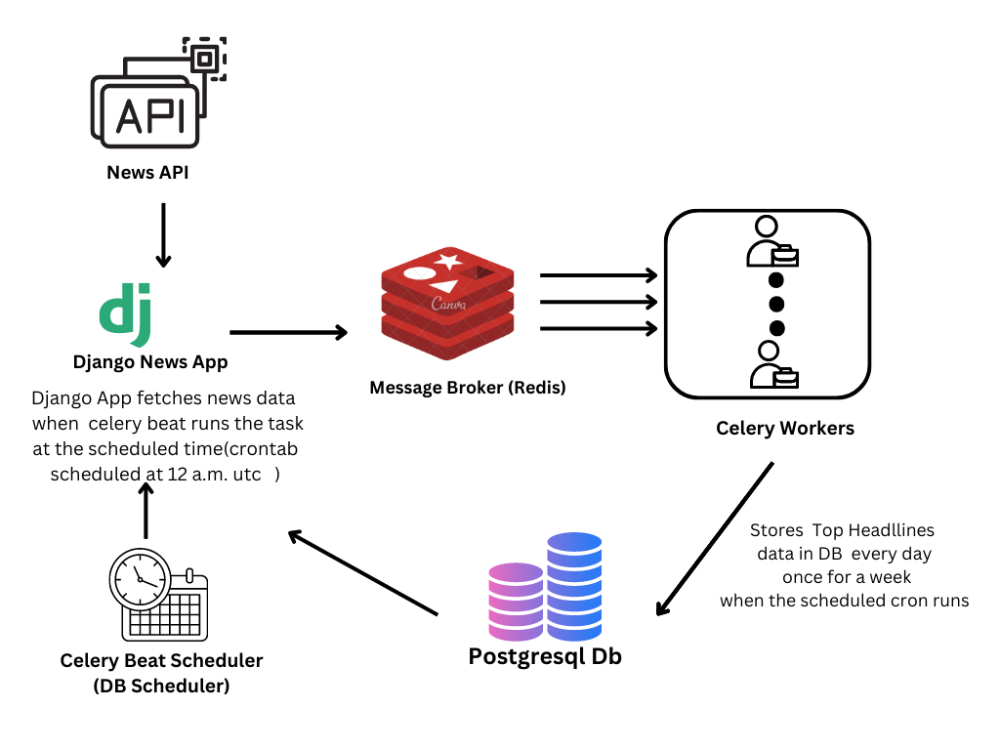
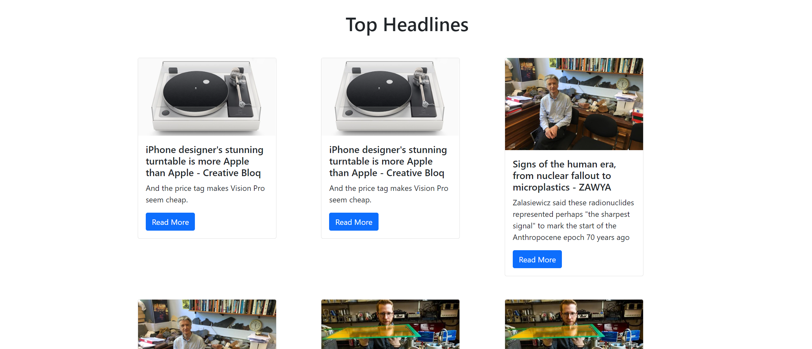
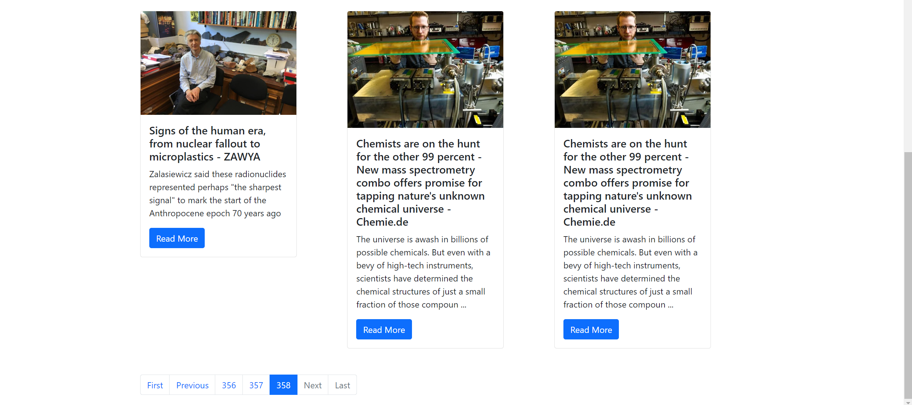
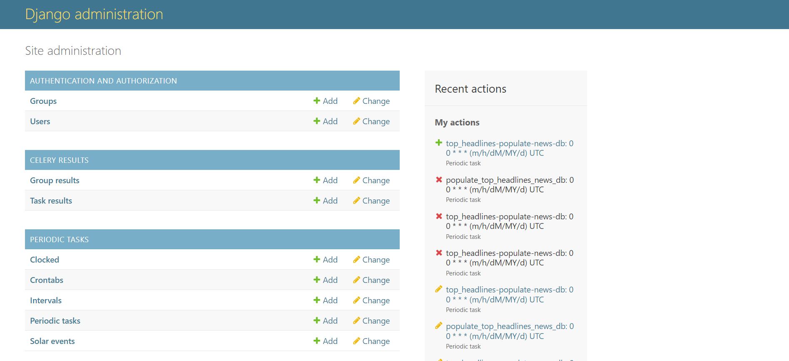
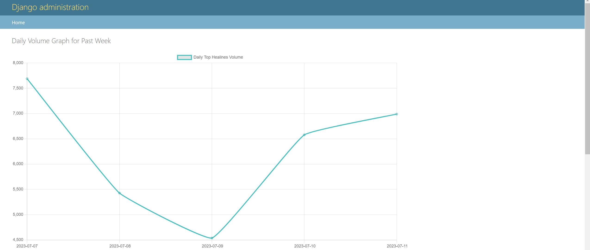
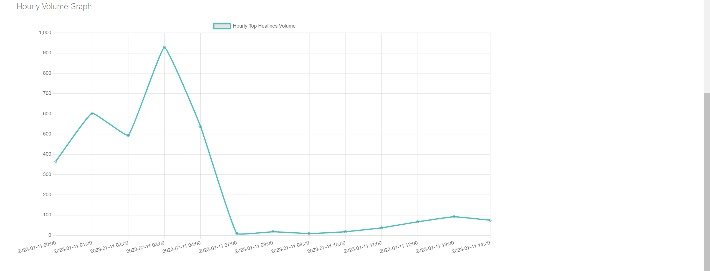

# NewsApp
 

## Installation Instructions

- Docker
Download and setup docker and docker compose for your machine 
https://docs.docker.com/engine/install/

- Go to Newsaggregator directory
`cd newsaggregator`

- Create .env file
`touch .env`

- Put the following content
	```
	NEWS_API_KEY = 'your_api_key'
	DJANGO_SECRET_KEY = 'django_generate_secret'
	DB_NAME = 'Newsapp'
	DB_USER = 'postgres'
	DB_PASSWORD = 'password'
	DB_HOST = 'db'
	DB_PORT = '5432'
	CELERY_BROKER_REDIS_URL="redis://redis:6379"
	```
	Note: If you are using docker compose, just change NEWS_API_KEY and DJANGO_SECRET_KEY

- run `docker compose up`
	Note1: Docker will automatically create DB and run Scheme migrations
	Note2: When running for the first time
	- Admin User will be created with credentials Username: `admin`, Password: `adminpassword`
	- DB will be automatically populated from NewsAPI

## Features

- News APP UI.
- Pagination in UI.
- News API https://newsapi.org/ is used as a Datasource.
- Handled Pagination in API.
- Celery: Scheduling Data pipeline for storing data to DB from NewsAPI.
- Redis: Celery Message Broker.
- PostgreSQL DB: Used for Application Data Storage.
- Containerisation: Docker and Docker Compose, `docker compose up` one command to setup everything, Django, DB, Celery, Redis.
- Daily Volume Graph for past week
- Hourhly Volume Graph

## NEWS APP 

News App displays the top headlines stored in the postgres DB for the past 7 days.

### http://\<base_url>/

```
view: TopHeadlinesView
model: TopHeadlines
template: home.html
``` 

<br>
<br>

- Pagination is implemented for the top headlines  

<br>


### http://\<base_url>/admin

You can add and manage your periodic tasks from the Django Admin interface (Used django celery beat's  Database-backed Periodic Tasks) 
A daily schedule to retrieve news data (top headlines) every day is configured to run once a day at 12.am.utc for a period of one week (7 days). It is disabled after one week in the celery task file.

`task: populate_top_headlines_news_db`




### http://\<base_url>/admin/statistics

The hourly and daily news volume are plotted on graph using chart.js
```
view: volume_graphs
template: volume_graphs.html
 ```
#### Daily Volume



#### Hourly Volume


